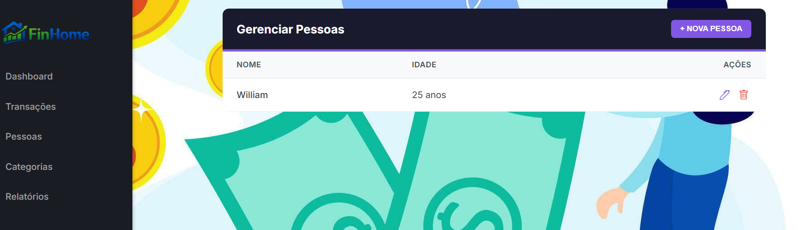
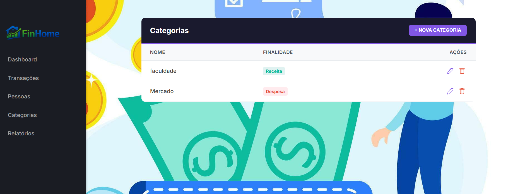
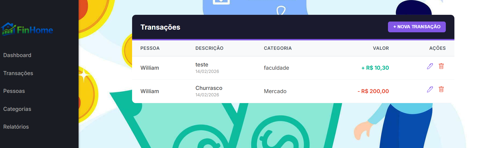
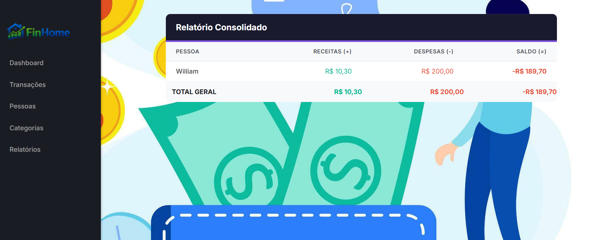
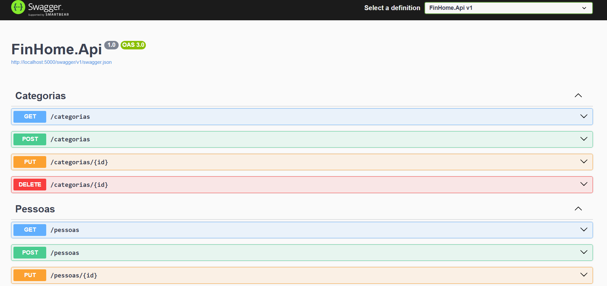
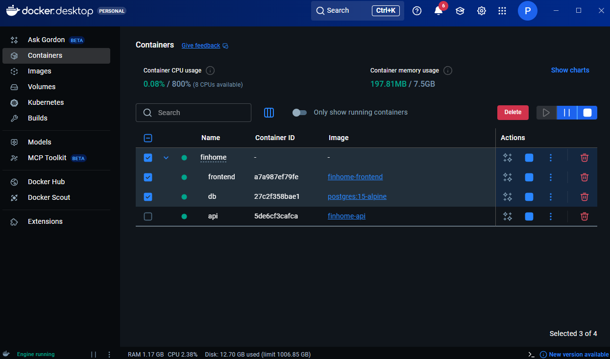

# FinHome

FinHome é uma aplicação Full Stack para gestão de gastos residenciais, desenvolvida para controle financeiro de pessoas, categorias e transações, aplicando regras de negócio e consolidação de dados.

O sistema foi construído com foco em arquitetura limpa, validação de domínio e facilidade de integração entre frontend e backend.

---

## Galeria da Aplicação

### 1. Módulo Pessoas
Gerenciamento completo de pessoas responsáveis pelas movimentações financeiras.



---

### 2. Módulo Categorias
Criação e classificação de categorias financeiras por finalidade.



---

### 3. Módulo Transações
Registro de receitas e despesas com aplicação de regras de negócio.



---

### 4. Módulo Relatórios
Consolidação financeira por pessoa e por categoria.



---

### 5. Documentação da API (Swagger)
Interface interativa para testes completos da API REST.



---

### 6. Infraestrutura em Execução (Docker)

Ambiente completo containerizado com Backend, Frontend e PostgreSQL executando simultaneamente.



---

## Stack Tecnológica e Versões

| Tecnologia | Versão | Finalidade |
|-----------|--------|-----------|
| .NET SDK | 8.0 | Runtime Backend |
| C# | 12.0 | Linguagem Backend |
| Entity Framework Core | 8.0.x | ORM e Migrations |
| PostgreSQL | 15-alpine | Banco de dados |
| React | 18.x | Interface Web |
| TypeScript | 5.x | Tipagem estática |
| Vite | 5.x | Build e hot reload |
| Docker | 24+ | Containerização |

---

## Arquitetura e Organização do Projeto

O projeto adota os princípios da Clean Architecture, organizando o código em camadas concêntricas onde as dependências sempre apontam para o domínio central.

### Camada de Domínio — FinHome.Domain

- Entidades principais: Pessoa, Categoria, Transacao  
- Interfaces de repositório  
- Independente de frameworks externos  

---

### Camada de Aplicação — FinHome.Application

- DTOs de entrada e saída  
- Serviços de aplicação  
- Orquestração das regras de negócio  
- Validações de domínio  

---

### Camada de Infraestrutura — FinHome.Infrastructure

- AppDbContext com EF Core  
- Mapeamentos via Fluent API  
- Repositórios  
- Persistência de dados  

---

### Camada de API — FinHome.Api

- Controllers REST  
- Injeção de Dependência  
- Middlewares  
- Exposição dos endpoints  

---

## Regras de Negócio

### Cascade Delete
Ao excluir uma pessoa, todas as transações vinculadas são removidas automaticamente.

### Validação de Menores de Idade
Pessoas menores de 18 anos não podem registrar transações do tipo Receita.

### Consistência Categoria x Tipo
O tipo da transação deve ser compatível com a finalidade da categoria.

### Restrições de Banco de Dados
- Nome limitado a 200 caracteres  
- Descrição limitada a 400 caracteres  

---

## Configuração de Ambiente

Este projeto utiliza variáveis de ambiente para configuração do banco de dados.

O arquivo `.env` **não é versionado no repositório** e deve ser criado manualmente.

### Criar arquivo `.env`

Na raiz do projeto, crie um arquivo com o seguinte conteúdo:

```bash
POSTGRES_USER=admin
POSTGRES_PASSWORD=adminpassword
POSTGRES_DB=finhomedb
POSTGRES_HOST=127.0.0.1
POSTGRES_PORT=5432
```
Essas variáveis são utilizadas pelo Docker Compose e pela API.

## Documentação e Testes da API (Swagger)

O projeto utiliza Swagger (OpenAPI 3.0) como ferramenta central de documentação e testes.

```bash
http://localhost:5000/swagger
```
Com o Swagger é possível:
* **Testar todos os endpoints**
* **Validar regras de negócio**
* **Visualizar os esquemas de dados**

## Visão Geral da API

### Pessoas
* **GET /pessoas**
* **POST /pessoas**
* **PUT /pessoas/{id}**
* **DELETE /pessoas/{id}**

### Categorias
* **GET /categorias**
* **POST /categorias**
* **PUT /categorias/{id}**
* **DELETE /categorias/{id}**

### Transações
* **GET /transacoes**
* **POST /transacoes**
* **PUT /transacoes/{id}**
* **DELETE /transacoes/{id}**

### Relatórios
* **GET /relatorios/por-pessoa**

## Como Executar o Projeto

### Pré-requisitos
* **Docker Desktop instalado**