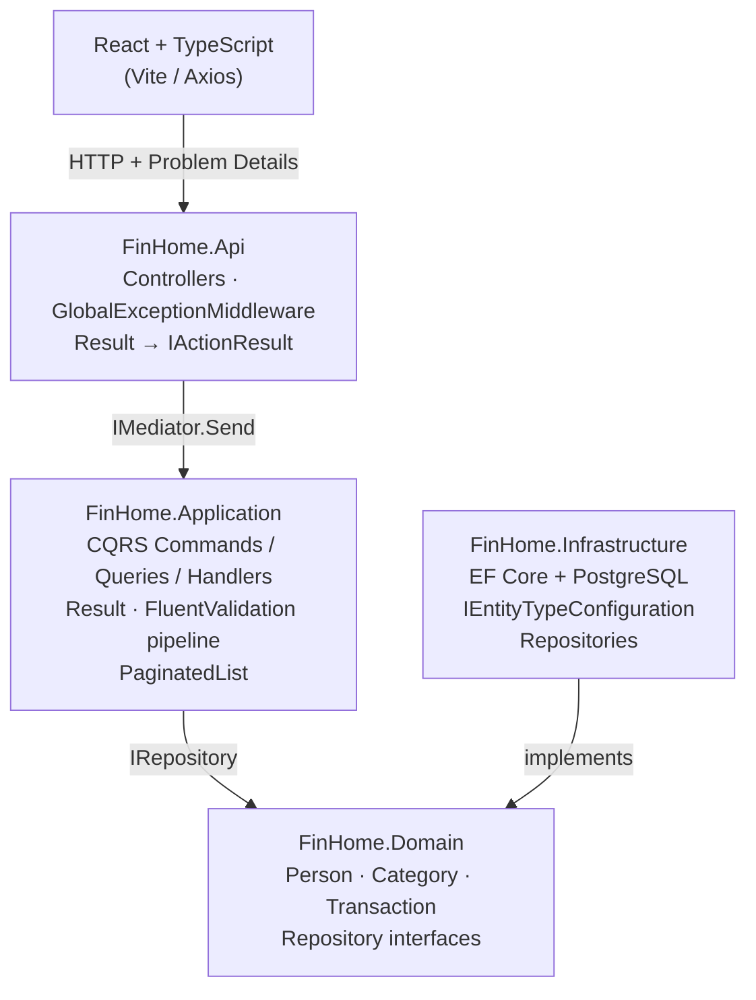

# FinHome

A full-stack household financial management system built with **.NET 10**, **Clean Architecture**, **CQRS + MediatR**, and **React + TypeScript**.

---

## Architecture



Dependency rule: `Domain ← Application ← Infrastructure ← Api`. Never the inverse.

---

## Tech Stack

| Layer | Technology | Version |
|-------|-----------|---------|
| Backend runtime | .NET | 8.0 |
| ORM | Entity Framework Core + Npgsql | 8.0 |
| CQRS dispatcher | MediatR | 12.3 |
| Validation | FluentValidation | 11.9 |
| Database | PostgreSQL | 16-alpine |
| Frontend | React + TypeScript + Vite | 19 / 5.9 / 7 |
| Styling | Tailwind CSS | 4 |
| HTTP client | Axios | 1.13 |
| Unit tests | xUnit + Moq + FluentAssertions | 2.9 / 4.20 / 6.12 |
| Integration tests | Testcontainers + WebApplicationFactory | 3.10 |
| Container | Docker + Docker Compose | — |
| CI | GitHub Actions | — |

---

## Design Decisions

### CQRS with MediatR
Every use case is an isolated `IRequest<T>` + handler. No service class shares state across operations:
- Each handler is independently testable with a mocked repository
- `ValidationBehavior<TRequest, TResponse>` runs FluentValidation before every command — no explicit validation calls in controllers or handlers
- Queries and commands have distinct read/write responsibilities

### Result\<T\> Pattern
Business rule violations return `Result.Failure(message)` instead of throwing exceptions. The unhappy path is explicit in the handler signature; `GlobalExceptionMiddleware` handles only truly unexpected errors.

```csharp
if (person.Age < 18 && request.Type == TransactionType.Income)
    return Result<TransactionDto>.Failure("People under 18 cannot register income.");
```

### Entity Framework Core

| Practice | Why |
|---|---|
| `AsNoTracking()` on all read queries | Removes change-tracker overhead for read-only operations |
| Server-side `Select(p => new { Sum(...) })` in reports | EF translates to a single SQL `CASE WHEN` sum; avoids loading every row |
| `ExecuteDeleteAsync()` instead of `FindAsync` + `Remove` | One SQL `DELETE WHERE` instead of SELECT + DELETE |
| `IEntityTypeConfiguration<T>` per entity | Schema definition co-located with entity; prevents cluttered `OnModelCreating` |
| `HasIndex` on `Date`, composite `(Date, Type)` | Report queries filter and sort by these columns |
| `HasPrecision(18, 2)` on decimal `Amount` | Prevents rounding errors in financial values |
| `DeleteBehavior.Cascade` explicitly declared | Schema intent visible in code, not hidden in migration diffs |

### IQueryable Repository
Repositories expose `IQueryable<T> Query()` so handlers compose server-side queries:

```csharp
var items = await _repo.Query()
    .AsNoTracking()
    .Select(p => new PersonDto(p.Id, p.Name, p.Age))
    .ToListAsync(ct);
```

---

## Business Rules

| Rule | Where enforced |
|------|---------------|
| People under 18 cannot register income | `CreateTransactionCommandHandler`, `UpdateTransactionCommandHandler` |
| Transaction type must match category purpose | Same handlers |
| Deleting a person cascades to their transactions | `TransactionConfiguration` — `DeleteBehavior.Cascade` |
| Deleting a category cascades to transactions | Same |
| Name ≤ 200 chars, Description ≤ 400 chars | `IEntityTypeConfiguration<T>` + FluentValidation |
| Amount must be > 0 | `CreateTransactionValidator`, `UpdateTransactionValidator` |

---

## API Endpoints

```
GET    /api/people?page=1&pageSize=20
GET    /api/people/{id}
POST   /api/people          → 201 Created
PUT    /api/people/{id}     → 204 No Content
DELETE /api/people/{id}     → 204 No Content

GET    /api/categories?page=1&pageSize=20
POST   /api/categories      → 201 Created
PUT    /api/categories/{id} → 204 No Content
DELETE /api/categories/{id} → 204 No Content

GET    /api/transactions?page=1&pageSize=20
GET    /api/transactions/{id}
POST   /api/transactions    → 201 Created
PUT    /api/transactions/{id}   → 204 No Content
DELETE /api/transactions/{id}   → 204 No Content

GET    /api/reports/by-person
GET    /api/reports/by-category
```

Error responses follow [RFC 7807 Problem Details](https://datatracker.ietf.org/doc/html/rfc7807):

```json
{
  "title": "Business rule violation",
  "detail": "People under 18 cannot register income transactions.",
  "status": 422
}
```

---

## Running Locally

### With Docker (recommended)

```bash
cp .env.example .env        # edit credentials if needed
docker-compose up --build
```

| Service | URL |
|---------|-----|
| Frontend | http://localhost:3000 |
| API | http://localhost:5000 |
| Swagger | http://localhost:5000/swagger |

### Without Docker

```bash
# Backend
cd backend
dotnet run --project FinHome.Api

# Frontend (separate terminal)
cd frontend
npm install && npm run dev
```

### Environment Variables (`.env`)

```
POSTGRES_USER=admin
POSTGRES_PASSWORD=adminpassword
POSTGRES_DB=finhomedb
POSTGRES_HOST=localhost
POSTGRES_PORT=5432
```

---

## Running Tests

```bash
cd backend

# Unit tests — no external dependencies
dotnet test FinHome.UnitTests

# Integration tests — requires Docker (Testcontainers spins up PostgreSQL)
dotnet test FinHome.IntegrationTests
```

---

## CI/CD

GitHub Actions (`.github/workflows/ci.yml`) runs on every push and pull request to `main`:

1. **Backend**: restore → build → unit tests → integration tests (PostgreSQL service container)
2. **Frontend**: `npm ci` → `npm run build`

---

## Project Structure

```
FinHome/
├── backend/
│   ├── FinHome.Domain/
│   │   ├── Entities/         Person, Category, Transaction
│   │   ├── Enums/            TransactionType, PurposeType
│   │   └── Interfaces/       IPersonRepository, ICategoryRepository, ITransactionRepository
│   ├── FinHome.Application/
│   │   ├── Behaviors/        ValidationBehavior<TRequest, TResponse>
│   │   ├── Common/           Result<T>, PaginatedList<T>
│   │   ├── Features/
│   │   │   ├── People/       Commands + Queries + PersonDto
│   │   │   ├── Categories/   Commands + Queries + CategoryDto
│   │   │   ├── Transactions/ Commands + Queries + TransactionDto
│   │   │   └── Reports/      GetReportByPersonQuery, GetReportByCategoryQuery
│   │   └── Validators/       FluentValidation per command
│   ├── FinHome.Infrastructure/
│   │   ├── Data/
│   │   │   ├── AppDbContext.cs
│   │   │   ├── Configurations/   PersonConfig, CategoryConfig, TransactionConfig
│   │   │   └── Migrations/
│   │   └── Repositories/     PersonRepository, CategoryRepository, TransactionRepository
│   ├── FinHome.Api/
│   │   ├── Controllers/      PeopleController, CategoriesController, TransactionsController, ReportsController
│   │   ├── Extensions/       ResultExtensions (Result → IActionResult)
│   │   └── Middleware/       GlobalExceptionMiddleware
│   ├── FinHome.UnitTests/
│   └── FinHome.IntegrationTests/
├── frontend/
│   └── src/
│       ├── components/       TransactionForm, TransactionList, Buttons, Modal
│       ├── pages/            PeoplePage, CategoriesPage, TransactionsPage, ReportsPage
│       └── services/         api.ts (Axios + parseProblemDetail)
├── docker-compose.yml
└── .github/workflows/ci.yml
```
