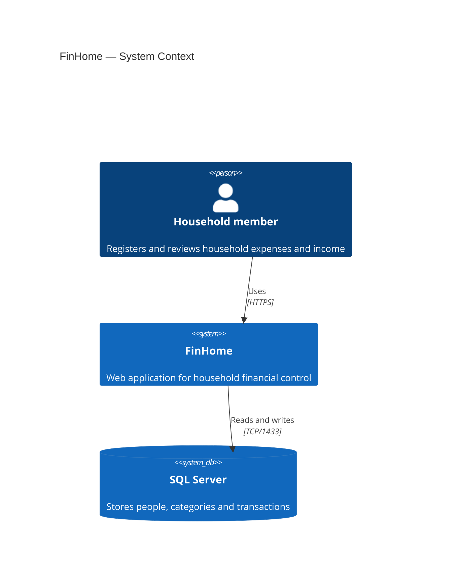
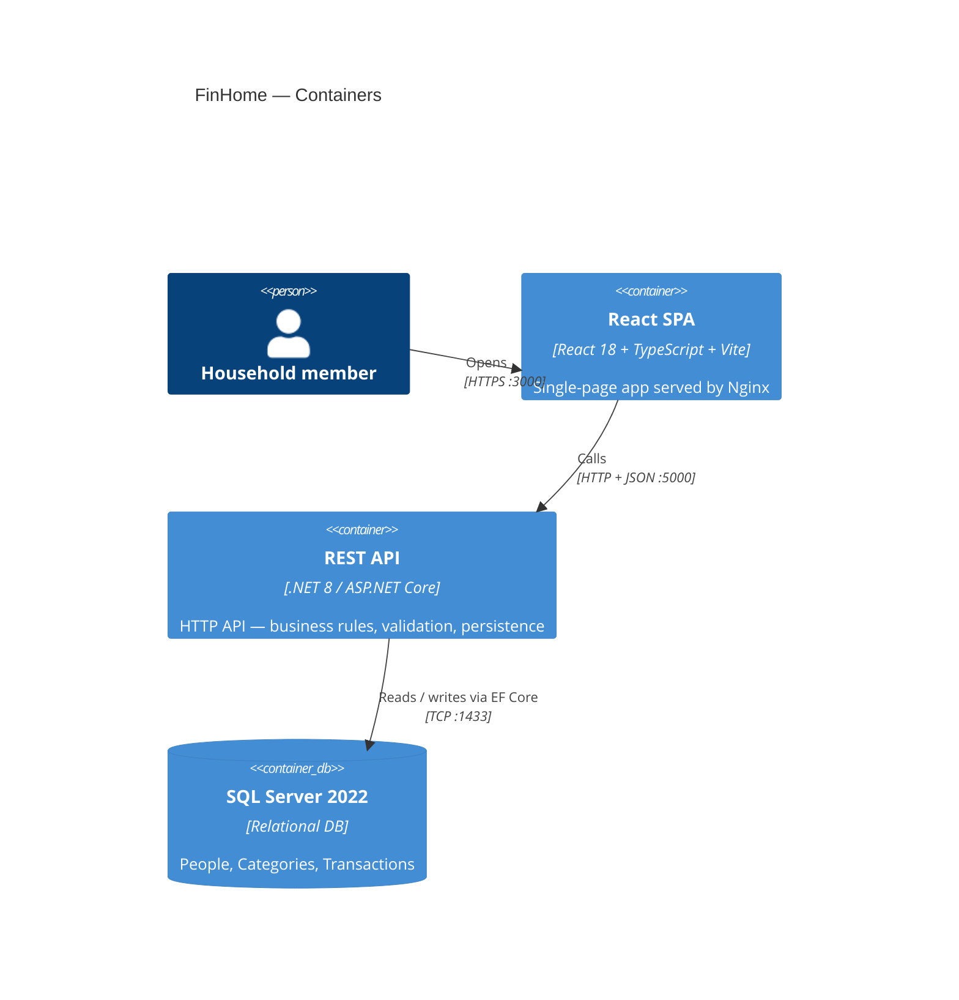
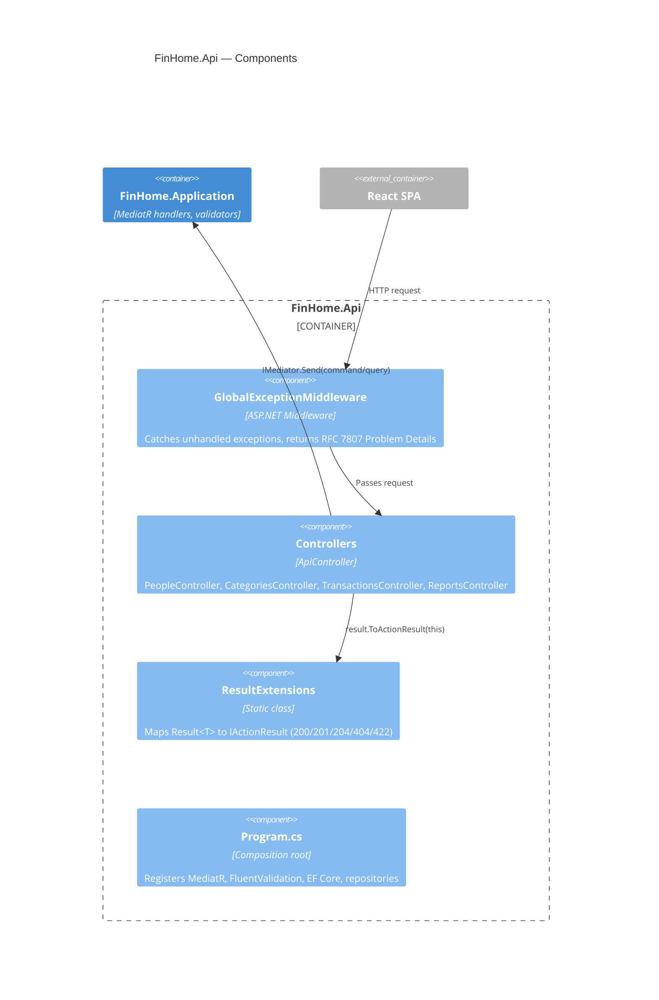
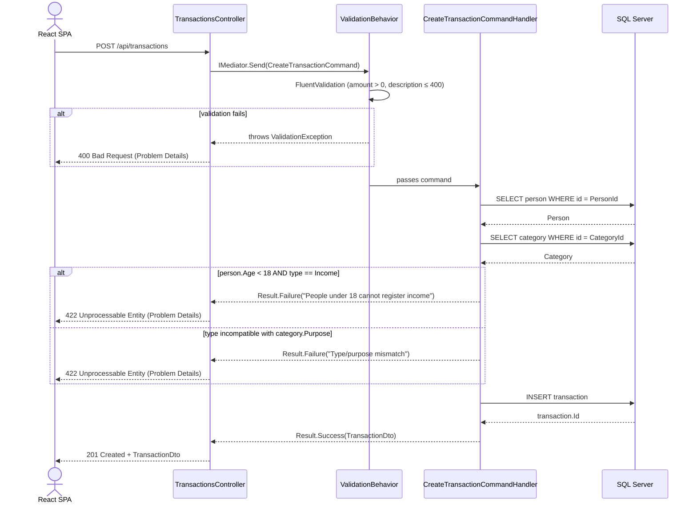
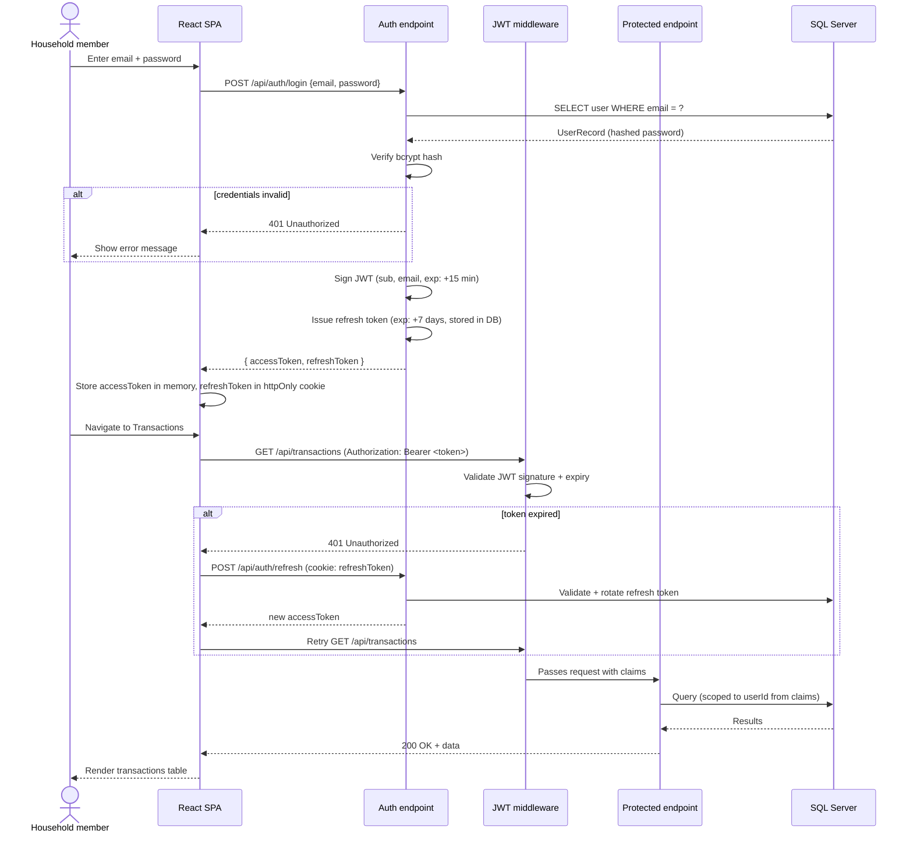

# Architecture

## Layers and dependency rule

```
Domain ← Application ← Infrastructure ← Api
```

Each arrow means "depends on." No layer may reference a layer to its right. Domain has zero dependencies — it is plain C# with no framework references.

| Layer | Project | Responsibility |
|---|---|---|
| Domain | `FinHome.Domain` | Entities, enums, repository interfaces. Zero external dependencies. |
| Application | `FinHome.Application` | CQRS commands/queries/handlers, DTOs, `Result<T>`, `PaginatedList<T>`, FluentValidation validators, `ValidationBehavior`. |
| Infrastructure | `FinHome.Infrastructure` | EF Core `AppDbContext`, `IEntityTypeConfiguration<T>` per entity, repository implementations, migrations. |
| API | `FinHome.Api` | ASP.NET Core controllers, `GlobalExceptionMiddleware`, `ResultExtensions` (maps `Result<T>` → `IActionResult`), DI composition root. |

---

## C4 — Context



---

## C4 — Container



---

## C4 — Component (API layer)



---

## Sequence — Create transaction (happy path + business rule violation)



---

## Sequence — JWT authentication (proposed future feature)

The current system has no authentication. The diagram below shows the **proposed JWT flow** planned for a future iteration.


