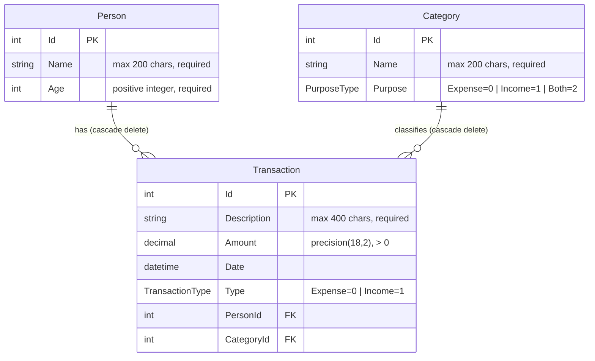

# Data Model

## Entity-Relationship diagram

## Column notes

| Column | Constraint | Enforcement |
|---|---|---|
| `Person.Name` | ≤ 200 chars, not null | `IEntityTypeConfiguration` + FluentValidation |
| `Person.Age` | > 0 | FluentValidation |
| `Category.Name` | ≤ 200 chars, not null | `IEntityTypeConfiguration` + FluentValidation |
| `Category.Purpose` | Enum (0/1/2) | Domain enum |
| `Transaction.Description` | ≤ 400 chars, not null | `IEntityTypeConfiguration` + FluentValidation |
| `Transaction.Amount` | `decimal(18,2)`, > 0 | `HasPrecision(18,2)` + FluentValidation |
| `Transaction.Type` | Enum (0/1) | Domain enum |

## Cascade behaviour

Both FK relationships use `DeleteBehavior.Cascade` declared explicitly in `IEntityTypeConfiguration<Transaction>`. Deleting a `Person` or a `Category` removes all linked `Transaction` rows in a single database operation.

## Indexes

| Index | Columns | Purpose |
|---|---|---|
| `IX_Transactions_Date` | `Date` | Report queries filter by date range |
| `IX_Transactions_Date_Type` | `Date, Type` | Report queries filter by both |
| `IX_Transactions_PersonId` | `PersonId` | FK lookup, cascade delete scan |
| `IX_Transactions_CategoryId` | `CategoryId` | FK lookup, cascade delete scan |
