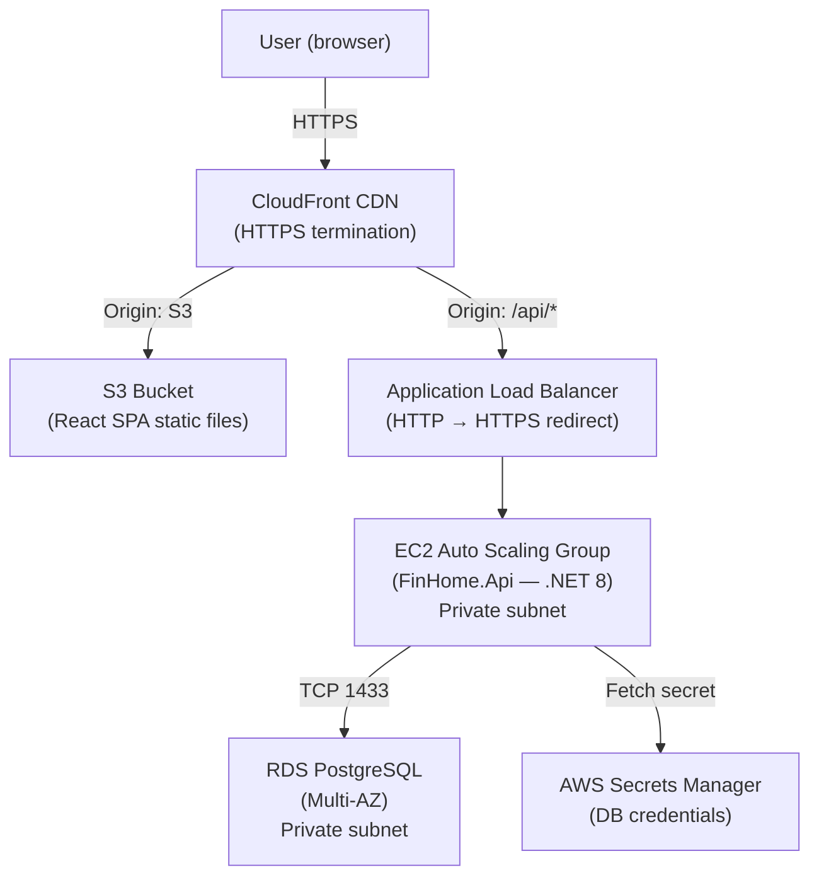
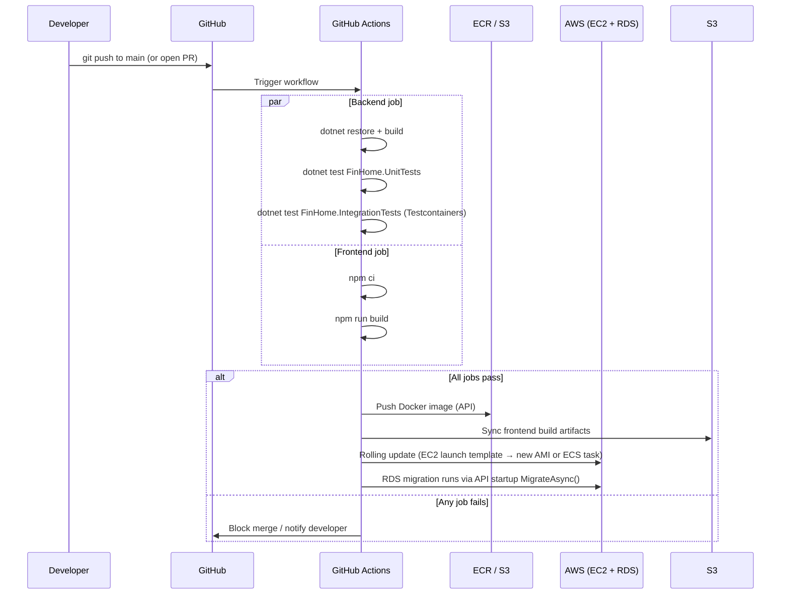

# Deployment

## Current setup (Docker Compose — local / VPS)

```
docker compose up --build
```

Three services defined in `docker-compose.yml`:

| Service | Image | Port |
|---|---|---|
| `db` | `postgres:16-alpine` | 5432 |
| `api` | `./backend/Dockerfile` | 5000 |
| `frontend` | `./frontend/Dockerfile` (Nginx) | 3000 |

The API runs `MigrateAsync()` on startup so the database schema is always up-to-date on first boot.

---

## Proposed AWS topology



### Component rationale

| Component | Role | Why |
|---|---|---|
| CloudFront | CDN + HTTPS | Serves static assets from S3 edge cache; routes `/api/*` to ALB |
| S3 | Static hosting | React build artifacts — zero server cost for frontend |
| ALB | Load balancer | Routes traffic to EC2 instances; handles TLS termination for API |
| EC2 Auto Scaling | API runtime | Horizontal scaling based on CPU/request metrics |
| RDS PostgreSQL (Multi-AZ) | Database | Managed PostgreSQL with automatic failover, backups, patch management |
| Secrets Manager | Credentials | DB password injected at runtime; never stored in code or environment files |

---

## CI/CD pipeline



### Deploy flow

1. **Backend** — Docker image built and pushed to ECR. EC2 Auto Scaling Group performs a rolling replacement using the new image.
2. **Frontend** — `npm run build` output synced to S3 with `aws s3 sync --delete`. CloudFront invalidation flushes the CDN cache.
3. **Database migrations** — `MigrateAsync()` on API startup applies pending migrations. No manual migration steps.

### Rollback

- API: redeploy previous ECR image tag via Auto Scaling launch template.
- Frontend: restore previous S3 objects from versioned bucket.
- Database: EF Core migrations are additive by convention; destructive changes require a manual rollback migration.

---

## Environment variables

| Variable | Used by | Description |
|---|---|---|
| `POSTGRES_HOST` | API | DB hostname |
| `POSTGRES_PORT` | API | DB port (default 5432) |
| `POSTGRES_DB` | API | Database name |
| `POSTGRES_USER` | API | DB username (default `postgres`) |
| `POSTGRES_PASSWORD` | API | DB password — injected from Secrets Manager in AWS |

Local development uses `.env` (git-ignored). Production uses AWS Secrets Manager + EC2 instance profile.
